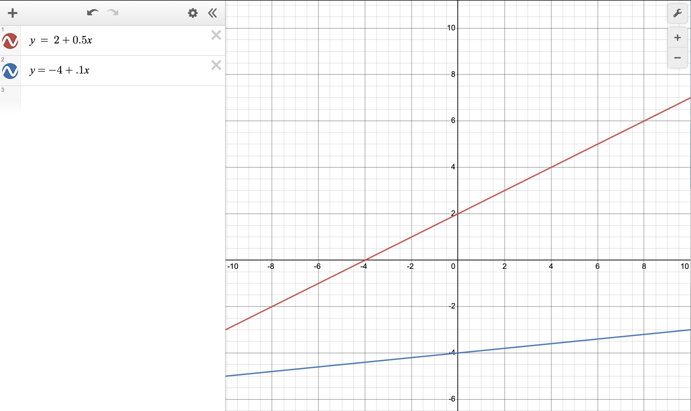
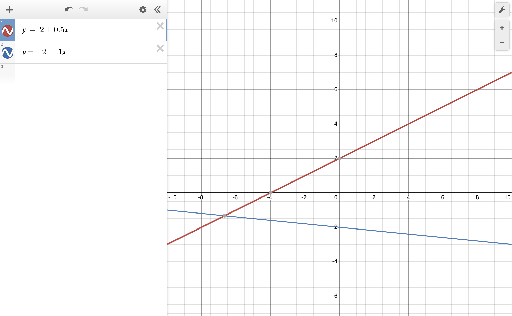
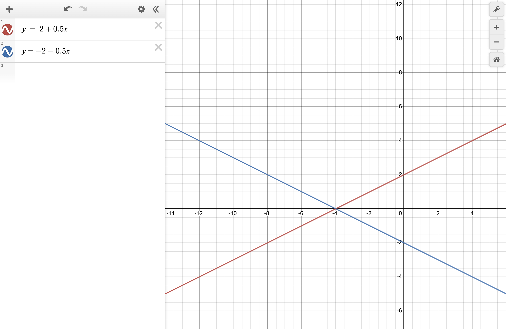
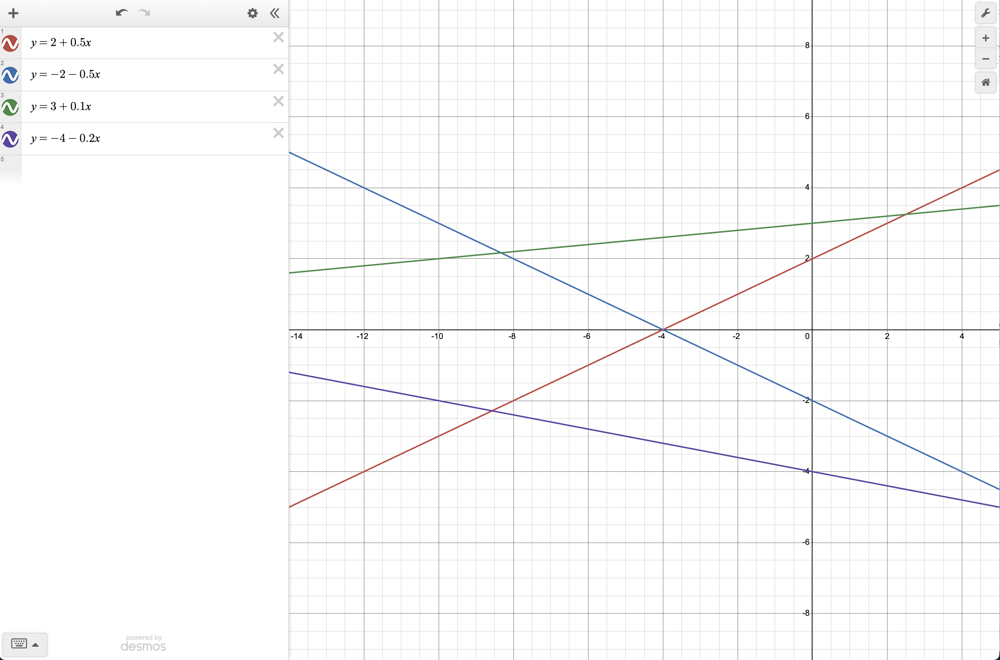

```{r}
library(pander)
```


# What it means to "Hide a Model" {.tabset .tabset-pills}


## Two-lines model {.tabset .tabset-pills}

$$
  Y_i = \beta_0 + \beta_1 X_{1i} + \beta_2 X_{2i} + \beta_3 X_{1i} X_{2i} + \epsilon_i \quad \text{where} \ \epsilon_i \sim N(0,\sigma^2) \\
  X_{2i} = \left\{\begin{array}{ll}
    0, & \text{Group 1} \\
    1, & \text{Group 2} \\
  \end{array}\right.
$$
Let's look at three different applications of this model. Even though these are all two-lines models, some models are harder to find with the pairs plot than other models. Compare each of these. Study how they were made and what is different about them. Learn what makes a model hard to find.

### Easy to Find {.tabset}

#### Desmos



#### R Plot

```{r}
set.seed(100)

n <- 40

x1 <- runif(n, -10, 10) #true x-axis variable
x2 <- rchisq(n, 3) #garbage
x3 <- sample(c(0,1), n, replace=TRUE) #true on-off switch
x4 <- sample(c(0,1), n, replace=TRUE) #garbage
x5 <- rf(n, 2, 3) #garbage
  
#Use red line as base line:
beta0 <- 2
beta1 <- 0.5

#These give the changes needed to achieve the blue line
beta2 <- -6 #(beta0 + beta2 = -4)
beta3 <- -0.4 #(beta1 + beta3 = 0.1)

sigma <- 0.8

#Required to have normally distributed error terms
epsilon_i <- rnorm(n, 0, sigma)

y <- beta0 + beta1*x1 + beta2*x3 + beta3*x1*x3 + epsilon_i

rbdata <- data.frame(y, x1, x2, x3, x4, x5)

palette(c("red","blue"))
plot(y ~ x1, data=rbdata, col=as.factor(x3))
truelm <- lm(y ~ x1 + x3 + x1:x3, data=rbdata)
b <- coef(truelm)
x3=0
curve(b[1] + b[2]*x1 + b[3]*x3 + b[4]*x1*x3, xname="x1", add=TRUE, col="red")
x3=1
curve(b[1] + b[2]*x1 + b[3]*x3 + b[4]*x1*x3, xname="x1", add=TRUE, col="blue")

summary(truelm)
```

#### Pairs Plot

Notice how obvious it is that x3 matters and that x1 has two separate lines showing in it.

```{r}
pairs(rbdata, panel=panel.smooth)
```


<hr>

### Better {.tabset}

#### Desmos



#### R Plot

```{r}
set.seed(100)

n <- 40

x1 <- runif(n, -10, 10) #true x-axis variable
x2 <- rchisq(n, 3) #garbage
x3 <- sample(c(0,1), n, replace=TRUE) #true on-off switch
x4 <- sample(c(0,1), n, replace=TRUE) #garbage
x5 <- rf(n, 2, 3) #garbage
  
#Use red line as base line:
beta0 <- 2
beta1 <- 0.5

#These give the changes needed to achieve the blue line
beta2 <- -4 #(beta0 + beta2 = -2)
beta3 <- -0.6 #(beta1 + beta3 = -0.1)

sigma <- 2.2

#Required to have normally distributed error terms
epsilon_i <- rnorm(n, 0, sigma)

y <- beta0 + beta1*x1 + beta2*x3 + beta3*x1*x3 + epsilon_i

rbdata <- data.frame(y, x1, x2, x3, x4, x5)

palette(c("red","blue"))
plot(y ~ x1, data=rbdata, col=as.factor(x3))
truelm <- lm(y ~ x1 + x3 + x1:x3, data=rbdata)
b <- coef(truelm)
x3=0
curve(b[1] + b[2]*x1 + b[3]*x3 + b[4]*x1*x3, xname="x1", add=TRUE, col="red")
x3=1
curve(b[1] + b[2]*x1 + b[3]*x3 + b[4]*x1*x3, xname="x1", add=TRUE, col="blue")

summary(truelm)
```

#### Pairs Plot

Notice how obvious it is that x3 matters, even though x1 is fairly well hidden.

```{r}
pairs(rbdata, panel=panel.smooth)
```


<hr>

### Well Hidden {.tabset}


#### Desmos



#### R Plot

```{r}
set.seed(100)

n <- 40

x1 <- runif(n, -14, 6) #true x-axis variable
x2 <- rchisq(n, 3) #garbage
x3 <- sample(c(0,1), n, replace=TRUE) #true on-off switch
x4 <- sample(c(0,1), n, replace=TRUE) #garbage
x5 <- rf(n, 2, 3) #garbage
  
#Use red line as base line:
beta0 <- 2
beta1 <- 0.5

#These give the changes needed to achieve the blue line
beta2 <- -4 #(beta0 + beta2 = -2)
beta3 <- -1 #(beta1 + beta3 = -0.5)

sigma <- 2.8

#Required to have normally distributed error terms
epsilon_i <- rnorm(n, 0, sigma)

y <- beta0 + beta1*x1 + beta2*x3 + beta3*x1*x3 + epsilon_i

rbdata <- data.frame(y, x1, x2, x3, x4, x5)

palette(c("red","blue"))
plot(y ~ x1, data=rbdata, col=as.factor(x3))
truelm <- lm(y ~ x1 + x3 + x1:x3, data=rbdata)
b <- coef(truelm)
x3=0
curve(b[1] + b[2]*x1 + b[3]*x3 + b[4]*x1*x3, xname="x1", add=TRUE, col="red")
x3=1
curve(b[1] + b[2]*x1 + b[3]*x3 + b[4]*x1*x3, xname="x1", add=TRUE, col="blue")

summary(truelm)
```

#### Pairs Plot

The pairs plot doesn't really show that x1 or x3 matter. They are both well hidden. If anything, x4 almost looks like it should matter, but it doesn't. So this would be a hard model to find, even though it is just a basic two-lines model.

```{r}
pairs(rbdata, panel=panel.smooth)
```


## Four-lines model {.tabset .tabset-pills}

$$
  Y_i = \beta_0 + \beta_1 X_{1i} + \text{(baseline)} \\
  \beta_2 X_{2i} + \beta_3 X_{1i} X_{2i} + \text{(adjustments for x2 line)}\\
  \beta_4 X_{3i} + \beta_5 X_{1i} X_{3i} + \text{(adjustments for x3 line)}\\
  \beta_6 X_{2i} X_{3i} + \beta_7 X_{1i} X_{2i} X_{3i} + \text{(adjustments for x2:x3 combo line)} +  \epsilon_i \\
  \quad \text{where} \ \epsilon_i \sim N(0,\sigma^2) \\
   X_{2i} = \left\{\begin{array}{ll}
    0, & \text{Group 1 of Factor 1} \\
    1, & \text{Group 2 of Factor 1} \\
  \end{array}\right.   \text{and} \ X_{3i} = \left\{\begin{array}{ll}
    0, & \text{Group 1 of Factor 2} \\
    1, & \text{Group 2 of Factor 2} \\
  \end{array}\right.
$$


### Good {.tabset}


#### Desmos



#### R Plot

```{r}
set.seed(100)

n <- 80

x1 <- runif(n, -14, 6) #true x-axis variable
x2 <- rchisq(n, 3) #garbage
x3 <- sample(c(0,1), n, replace=TRUE) #true on-off switch
x4 <- sample(c(0,1), n, replace=TRUE) #true on-off switch
x5 <- rf(n, 2, 3) #garbage
  
#Use red line as base line:
beta0 <- 2
beta1 <- 0.5

#These give the changes needed to achieve the blue line
beta2 <- -4 #(beta0 + beta2 = -2)
beta3 <- -1 #(beta1 + beta3 = -0.5)

#These give the changes needed to achieve the green line
beta4 <- 1 #(beta0 + beta4 = 3)
beta5 <- -0.4 #(beta1 + beta5 = 0.1)

#These give the changes needed to achieve the purple line
beta6 <- -3 #(beta0 + beta2 + beta4 + beta6 = -4)
beta7 <- 0.7 #(beta1 + beta3 + beta5 + beta7 = -0.2)


sigma <- 0.8

#Required to have normally distributed error terms
epsilon_i <- rnorm(n, 0, sigma)

y <- beta0 + beta1*x1 + 
  beta2*x3 + beta3*x1*x3 + 
  beta4*x4 + beta5*x1*x4 + 
  beta6*x3*x4 + beta7*x1*x3*x4 + epsilon_i

rbdata <- data.frame(y, x1, x2, x3, x4, x5)

palette(c("red2","steelblue3","green4","purple3"))
plot(y ~ x1, data=rbdata, col=interaction(x3,x4))
truelm <- lm(y ~ x1 + 
               x3 + x1:x3 + 
               x4 + x1:x4 + 
               x3:x4 + x3:x4:x1, data=rbdata)
b <- coef(truelm)
b

drawit <- function(x3=0,x4=0, color="black"){
  curve(b[1] + b[2]*x1 + b[3]*x3 + b[4]*x4 + b[5]*x1*x3 + b[6]*x1*x4 + b[7]*x3*x4 + b[8]*x1*x3*x4, xname="x1", add=TRUE, col=color)
}

drawit(x3=0, x4=0, color="red2")
drawit(x3=1, x4=0, color="steelblue3")
drawit(x3=0, x4=1, color="green4")
drawit(x3=1, x4=1, color="purple3")

summary(truelm)
```

#### Pairs Plot

```{r}
pairs(rbdata, panel=panel.smooth)
```

### Well Hidden {.tabset}

What would need to happen to the Desmos plot to make this become really well hidden? Hint, think about what the pairs plot in the Good example easily gave away and how you could hide that.


<hr>

